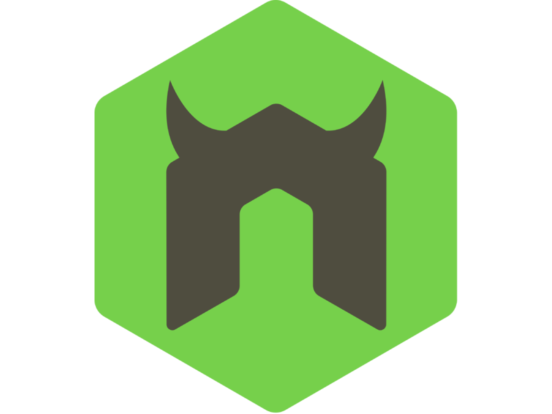

<h1>Hi there 👨🏾‍🦱👋🏾</h1>

<a class="badge-base__link LI-simple-link" href="https://www.linkedin.com/in/hamjad-idris/">Hamjad Idris</a>

            
<h1>Welcome, I'm HAMJAD    </h1>

###   **What's my current role in tech?**</h2>
       { Web Developer || full-Stack Developer }  

#### Connect with me  

#### About
Here are some basic things to know about Hamjad;

- <strong>☁︎ Production-ready full stack developer,</strong>
- <strong>☁︎ Improving on my skills, determined to being the absolute best,</strong>
- <strong>☁︎ Excited and looking forward to collaborate and work on all web related projects ⚛︎,</strong>
 <!--- 🤔 I’m looking for help with--> 
- 💬 <strong>lets talk ☎︎,</strong>
- 📫 <strong>How to reach me ✉︎:</strong> Email: dajmahsirdi@gmail.com, Phone: +2348127127270,
- <strong>Pronouns:</strong> He/Him,
- <strong>☂︎ Not-so-fun fact:</strong> existential dread is the fair price those who question pay.

#### My Core Languages
<code></code>
<code></code>
<code></code>
<code></code>
<code></code>

#### Frameworks I Use
<code></code>
<code></code>  
<code></code>
<code></code>
<code></code>
<code></code>
<code></code>

#### Tools I Use
<code></code>
<code></code>
<code></code>
<code></code>
<code></code>
<code></code>
<code></code>

